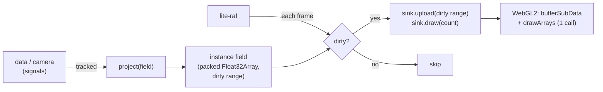

# @zakkster/lite-gl

[](https://www.npmjs.com/package/@zakkster/lite-gl)

[](https://github.com/sponsors/PeshoVurtoleta)
[](https://bundlephobia.com/result?p=@zakkster/lite-gl)
[](https://www.npmjs.com/package/@zakkster/lite-gl)
[](https://www.npmjs.com/package/@zakkster/lite-gl)
[](https://github.com/PeshoVurtoleta/lite-signal)


[](https://opensource.org/licenses/MIT)

**A signal-native instanced primitive renderer — built for reactive charts at ~1M points, not as a Pixi competitor.**

The moat here isn't the `gl.draw` call; Pixi and Three have that. It's the
**zero-GC, dirty-batched instance engine** that feeds the GPU from your reactive
graph: a packed buffer that re-projects a million points without allocating,
uploads only what changed, and redraws in **one draw call** — driven by a
camera or data **signal**.

```
npm install @zakkster/lite-gl
```

> **Peers:** `@zakkster/lite-signal` (the reactive driver) and `@zakkster/lite-raf`
> (the loop). ESM only. MIT.

---

## Tested core + swappable GPU backend

lite-gl is split so the valuable, novel half is verifiable:

- **`@zakkster/lite-gl`** (the core) is **renderer-agnostic and fully tested**,
  including the 1M-point zero-GC claim. It manages the packed buffer, the dirty
  range, and the reactive projection.
- **`@zakkster/lite-gl/backend`** is the **WebGL2 sink — browser-only.** Both the
  `POINT` and `QUAD` sinks have their GL call sequence **unit-tested headlessly
  against a mock WebGL2 context** (compile/link, the one-time VBO sizing, the
  instance attributes + `vertexAttribDivisor`, the dirty-window `bufferSubData`, and
  the `POINTS` / instanced `TRIANGLE_STRIP` draw); only the **real-GPU rendering**
  needs a browser, since CI has no GPU. Swap it for a WebGPU or canvas sink without
  touching the core.

The honest line: the core and the backend's GL wiring are both tested; the pixels
on a real GPU are yours to confirm in a browser.

---

## Shape of it

```js
import { signal } from "@zakkster/lite-signal";
import { startFrames } from "@zakkster/lite-raf";
import { createField, reactiveField, LAYOUT } from "@zakkster/lite-gl";
import { createPointSink } from "@zakkster/lite-gl/backend";   // browser

const gl = canvas.getContext("webgl2");
const sink = createPointSink(gl, { capacity: 1_000_000 });
sink.resize(canvas.width, canvas.height);

// 1M data points (your columns)
const N = 1_000_000;
const xs = new Float64Array(N), ys = new Float64Array(N);   // ...filled from your data
const camera = signal({ x: 0, y: 0, scale: 1 });            // pan/zoom as a signal

const field = createField({ capacity: N, stride: LAYOUT.POINT });
field.setCount(N);

// project world -> screen pixels into the packed buffer; re-runs when `camera` changes
const project = (f) => {
  const cam = camera();                       // tracked
  const data = f.data, s = cam.scale;
  for (let i = 0; i < N; i++) {
    const b = i * LAYOUT.POINT;
    data[b]     = (xs[i] - cam.x) * s;         // x px
    data[b + 1] = (ys[i] - cam.y) * s;         // y px
    data[b + 2] = 2;                           // size
    data[b + 3] = 0.3; data[b + 4] = 0.8; data[b + 5] = 1; data[b + 6] = 1;  // rgba
  }
  f.touchAll();
};

reactiveField(field, { project, sink });      // auto-drives on lite-raf

camera.set({ x: 120, y: 0, scale: 2 });        // pan/zoom -> re-project -> one upload + one draw
```

Move the camera signal and the whole field re-projects and redraws — one
`bufferSubData`, one `drawArrays`. Nothing allocates.

---

## How it flows



`project` re-runs when a tracked signal changes (marking the field dirty); the raf
tick flushes the dirty range once per frame and **only redraws when something
changed**.

---

## Why instanced + dirty-range matters

- **One draw call** for the whole set (`drawArrays(POINTS, 0, count)` for points;
  `drawArraysInstanced` for quads/lines), instead of per-object draws.
- **Upload only the dirty window.** Edit 200 of a million points and only those
  floats hit `bufferSubData` — the other ~8M are untouched.
- **The backing buffer is never reallocated** while you stay within capacity, so a
  per-frame re-projection allocates nothing. Verified: **60 frames of full
  1M-point re-projection, buffer reference unchanged, engine counters flat.**

What kills WebGL apps is per-frame buffer/GC churn; the discipline that avoids it
is the whole point of this package.

---

## Composition

- **Camera:** project from a [`lite-camera-max`](https://www.npmjs.com/package/@zakkster/lite-camera-max)
  view, so pan/zoom is a signal in the reactive graph and the shader only maps
  pixels to clip space.
- **Charts:** this is the renderer [`lite-charts`](https://www.npmjs.com/package/@zakkster/lite-charts)
  reaches for past the Canvas2D ceiling (tens of thousands) into the hundreds of
  thousands / millions.
- **Profiler counters (v1.5, optional, zero-dep):** every sink takes an optional
  `counters` handle -- the duck-typed `{ recordUpload(floatCount), recordDraw(drawCount) }`
  shape [`lite-profiler`](https://www.npmjs.com/package/@zakkster/lite-profiler) 1.2.0
  exposes -- and emits its per-frame draw/upload metrics into it. It stays a **peer /
  optional** integration: `dependencies` is empty, nothing is imported at runtime, and
  when no handle is attached the hot path is byte-identical to before (a method swap, not
  a per-frame branch -- the zero-GC gate is `0 B/op` with or without it). A `pick()` never
  counts (its internal ID render bypasses `draw`/`upload`).

  ```js
  import { createProfiler } from "@zakkster/lite-profiler";   // peer, optional
  const prof = createProfiler();

  const points = createPointSink(gl, { capacity: 1_000_000, counters: prof.counters });
  // or attach/detach later:
  points.setCounters(prof.counters);   // start recording
  points.setCounters(null);            // stop

  // each flushed frame now feeds prof.counters:
  //   recordUpload(floatCount)  -- the dirty-window float count actually uploaded
  //   recordDraw(1)             -- one GPU draw per non-empty draw
  // pick() is NOT counted (offscreen ID-buffer render); a context-loss re-seed IS
  // counted -- it re-uploads the full range to the visible pipeline.
  ```

---

## Honest scope (the non-claims)

- The **core** (buffer, dirty batching, reactive projection, 1M zero-GC) is tested.
  The **rendering** (shader compile, instanced draw, 60fps at 1M) is **browser-
  validated by you** — it cannot run headlessly, so the package makes no automated
  claim about it.
- **v1.2 ships all three pipelines — POINT, QUAD, and LINE.** Scatter / particles;
  bars, sized/rotated markers, and heatmap cells; and now thick polylines for line
  charts. All three drive the same zero-GC core via a static instanced base geometry
  + `vertexAttribDivisor`. `LINE` uses **butt caps** only in 1.2 (ends cut
  perpendicular; a polyline is N−1 independent segments); round joins are a 1.3
  follow-up if seams show at chart widths.
- **v1.3 adds multi-field scenes and picking.** Sinks of the same primitive type share
  one linked program *per GL context* (refcounted, so disposing one sink can't pull the
  program out from under another); `setScissor` clips a field to a pane; `pick(x, y)`
  runs one offscreen ID pass and reads back a single pixel. Honest limits: picking costs
  one extra draw **per call**, so throttle it to `pointermove` rather than the frame
  loop; overlapping instances resolve as last-drawn-wins (painter's order); and `pick`
  is per-sink — for cross-field picking, call it on each field in z-order.
- **Re-projection is O(N):** a camera/data change re-projects all instances. That's
  cheap on CPU (a million simple writes is sub-millisecond); the pipeline stays
  allocation-free, which is what actually protects the frame budget.
- Not a scene graph, sprite batcher, text renderer, or filter stack. If you want
  Pixi, use Pixi.

---

## API

```ts
// core (@zakkster/lite-gl)
createField({ capacity?, stride }): Field
reactiveField(field, { project, sink, manual? }): { frame, flush, stop, dispose }
createDriver(registry): { reactiveField }
LAYOUT = { POINT: 8, QUAD: 9, LINE: 9, POINT_HI: 10 }

interface Field {
  data: Float32Array; count; capacity
  push(write): number; set(i, write); swapRemove(i); setCount(n)
  touch(i); touchAll(); clearDirty(); dirtyLo(); dirtyHi()
  flush(sink); reset()
}
interface Sink {
  upload(data, floatOffset, floatCount, instanceOffset, stride): void
  draw(count): void
}

// backend (@zakkster/lite-gl/backend, browser-only)
createPointSink(gl: WebGL2RenderingContext, { capacity, counters? }): PointSink   // LAYOUT.POINT -> GL_POINTS
createQuadSink(gl: WebGL2RenderingContext, { capacity, counters? }): QuadSink    // LAYOUT.QUAD  -> instanced TRIANGLE_STRIP
createLineSink(gl: WebGL2RenderingContext, { capacity, counters? }): LineSink    // LAYOUT.LINE  -> instanced TRIANGLE_STRIP (thick segments)
PICK_MAX_ID                                                           // 0xFFFFFE

// all three sinks expose the same surface:
//   upload(data, floatOffset, floatCount, instanceOffset, stride)
//   draw(count); resize(w, h); onContextRestored(cb); isContextLost(); capacity; dispose; gl
//   setScissor(x, y, w, h); clearScissor()      // v1.3 -- pane clipping, top-left origin
//   pick(x, y, count?) -> instance index | -1   // v1.3 -- GPU ID pass, no CPU hit-testing
//   setCounters(handle | null)                  // v1.5 -- optional lite-profiler counters (see Composition)
```

`QUAD` instances are `x, y, w, h, rot, r, g, b, a` (`LAYOUT.QUAD`, stride 9); `LINE`
instances are `x0, y0, x1, y1, width, r, g, b, a` (`LAYOUT.LINE`, stride 9) — the
endpoints and width are in **screen pixels**, expanded to a thick quad in the vertex
shader. Everything is screen-space — do world→screen in `project`, same as points.
`capacity` for a line sink is the number of **segments** (a polyline of N points is
N−1 segments).

### Multi-field scenes and picking (v1.3)

Many fields, one context, one program per primitive type:

```js
const points = createPointSink(gl, { capacity: 1_000_000 });   // links the point program
const glow   = createPointSink(gl, { capacity: 50_000 });      // reuses it (cached per context)
const lines  = createLineSink(gl,  { capacity: 300_000 });

// Two panes in one canvas, no extra framebuffers:
lines.setScissor(0, 0, 600, 800);       // left
points.setScissor(620, 0, 600, 800);    // right

// Hover at 1M points, without touching the CPU:
canvas.addEventListener("pointermove", (e) => {
  const i = points.pick(e.offsetX * dpr, e.offsetY * dpr);   // device px, top-left origin
  if (i !== -1) showTooltip(myData[i]);
});
```

`pick` renders one offscreen ID pass and reads back a single pixel, so the CPU never
hit-tests. It respects the sink's scissor (a hover can't hit a neighbouring pane) and
restores the framebuffer, clear colour and blend state it found. Call it on a throttled
`pointermove` — **not** every frame. IDs are 24-bit, so `0 … PICK_MAX_ID` are pickable.

---

### Deep zoom: world coordinates on the GPU (v1.4)

`LAYOUT.POINT`, `QUAD` and `LINE` hold **screen pixels**. That is the contract: `project()` runs in JS (float64) and writes post-camera coordinates, so the float32 field only ever sees small numbers. Relative-to-eye, by construction — which is why precision has never bitten you.

The cost shows up when the camera moves. A one-pixel pan re-projects **every** instance and dirties the whole field: ~5 ms of JS at 1M points, plus a **31 MB re-upload, every frame**. Panning a large field is CPU-bound, and the GPU never even sees a camera.

`LAYOUT.POINT_HI` (v1.4) holds **world coordinates**, uploads once, and puts the camera in the vertex shader:

```js
import { createField, reactiveField, LAYOUT, writePointHi, needsHiPrecision } from '@zakkster/lite-gl';
import { createPointHiSink } from '@zakkster/lite-gl/backend';

const sink = createPointHiSink(gl, { capacity: 1_000_000 });
const field = createField({ capacity: 1_000_000, stride: LAYOUT.POINT_HI });

// World coordinates. Raw timestamps — no projection, no camera.
for (let i = 0; i < n; i++) {
  field.push((d, base) => writePointHi(d, base, ts[i], value[i], 2, 0.3, 1, 0.6, 1));
}
field.flush(sink);          // the one and only upload

// A pan is four floats. No CPU work, no re-upload, no dirty range.
onPan((t, v, pxPerMs, pxPerUnit) => sink.setCamera(t, v, pxPerMs, pxPerUnit));
```

**Why the coordinates are split.** float32 carries a 24-bit significand — integers are exact only to 2²⁴ = 16,777,216. A Unix epoch millisecond is ~1.78 × 10¹², where the gap between representable values is **131,072 ms ≈ 2.2 minutes**. Store a raw timestamp in a float32 and a full minute of one-second ticks collapses onto a *single* value. Epoch-seconds is no escape (ULP ≈ 128 s).

So `POINT_HI` splits each coordinate into a hi/lo float32 pair, splits the camera the same way, and the shader computes:

```glsl
vec2 rel = (a_posHi - u_cameraHi) + (a_posLo - u_cameraLo);
```

The high parts are float32s of near-identical magnitude, so that subtraction cancels **exactly** (Sterbenz), and the residuals carry the detail. Order matters: subtract *first*. Scale first and the precision is already gone.

**The guarantee, stated honestly.** Error scales with distance **from the eye**, not with absolute magnitude. Anything within a day of the camera round-trips bit-exactly from an epoch-ms timestamp. A point a *year* away is good to ~800 ms — which sounds like a caveat and is the entire point: you only see distant points when you are zoomed **out**, and the pixel grows at exactly the rate the error does. Worst-case error across a 2000 px viewport is **~10⁻⁴ px — at any zoom, at any magnitude**. The naive path degrades with absolute magnitude, and nothing saves you from that.

Not sure whether you need it?

```js
needsHiPrecision(Date.now(), 1000);  // true  — 1s ticks in epoch-ms
needsHiPrecision(1e6, 0.5);          // false — ordinary chart coords, use LAYOUT.POINT
```

**On cameras.** `setCamera()` takes six plain numbers, and that is deliberate — `lite-gl` does not depend on a camera package, and should not. [`@zakkster/lite-camera`](https://github.com/PeshoVurtoleta/lite-camera) is a *game-follow* camera for Canvas2D: deadzone, lookahead, trauma shake, clamped to a world rect, and it emits a `ctx` transform rather than numbers. It has **no zoom at all**, it pins `x ≥ 0`, and its `apply()` does `ctx.translate(-(pos[0] | 0), …)` — a ToInt32 truncation that *wraps* at epoch-ms magnitudes. Every one of those is correct for a platformer and wrong for a chart. Drive `setCamera()` from whatever owns your pan/zoom state; the numeric seam is the integration.

**Use `POINT` for almost everything.** Reach for `POINT_HI` when the *world* coordinates are large — timestamps, geodetic coords, deep-zoom fractals — or when you pan a large field often enough that CPU re-projection is the bottleneck. `PointHiSink` carries the full v1.3 surface: scissor, `pick()`, shared program cache, context-loss recovery. The ID pass projects through the same camera as the visible pass, so hover stays honest at any zoom.

## Testing

```bash
npm test           # node:test unit + call-sequence suites, then the dirty-range gate
npm run test:gates # just the zero-tolerance dirty-range gate (headless, no GPU)
npm run test:torture   # node --expose-gc: the tiered zero-GC / retention gate (T0..T9)
npm run test:smoke     # Playwright real-GPU smoke (POINT/POINT_HI/QUAD/LINE)
```

- **`test/gates/dirty-range.mjs`** is a zero-tolerance build gate: a fixed op stream
  (append, scatter-edit single instances, swap-remove) runs against a mock sink that sums
  the uploaded float count, and the total is asserted against a **committed baseline
  constant** at zero tolerance. A regression where a one-instance edit re-uploads the whole
  buffer changes the total by thousands of floats and fails the build -- no GPU required.
  The file carries a self-control that simulates that regression and confirms the gate goes
  red. **To update the baseline** (a deliberate dirty-range contract change only): run the
  gate, read the printed measured total, and set `BASELINE` to it in the *same commit* as
  the change.
- **`test/torture.mjs`** tier **T8** proves the v1.5 counters seam: a mock counter fed a
  known op stream reports `floatsUploaded` equal to the summed dirty windows and `drawCalls`
  equal to the number of draws, a `pick()` records nothing, and the seam adds zero
  allocation with *or* without a counter attached.

## License

MIT (c) 2026 Zahary Shinikchiev &lt;shinikchiev@yahoo.com&gt;
